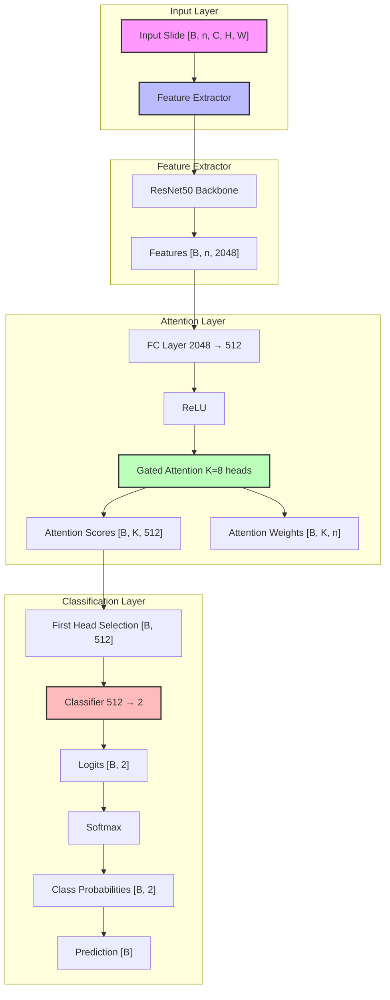

# CLAM (Clustering-constrained Attention Multiple Instance Learning) Model Architecture

## Overview
CLAM is a deep learning model designed for weakly supervised learning on gigapixel whole slide images (WSIs). It uses attention-based multiple instance learning (MIL) to classify slides based on their tiles/patches.

## Architecture Diagram



## Model Components

### 1. Feature Extractor
- Input: Image patches [B, n, C, H, W]
  - B: batch size
  - n: number of tiles
  - C: number of channels (3 for RGB)
  - H, W: height and width of patches
- Output: [B, n, 2048]
- Components:
  - Pre-trained ResNet50 backbone
  - Removes the final classification layer
  - Outputs 2048-dimensional features

### 2. Attention Mechanism
- Input: [B, n, 2048]
- Components:
  - FC Layer (2048 → 512)
  - ReLU activation
  - Gated Attention with 8 heads
- Output:
  - Attention scores: [B, K, 512]
  - Attention weights: [B, K, n]

### 3. Classification Head
- Input: [B, 512] (first attention head)
- Components:
  - Linear layer (512 → 2)
  - Softmax activation
- Output:
  - Logits: [B, 2]
  - Probabilities: [B, 2]
  - Prediction: [B]

## Key Features

1. **ResNet50 Backbone**
   - Pre-trained on ImageNet
   - Extracts high-level features from image patches
   - Output dimension: 2048

2. **Gated Attention**
   - Uses 8 attention heads
   - Each head produces attention scores and weights
   - Only first head is used for final classification

3. **Size Variants**
   - Small: [2048, 512, 256]
   - Big: [2048, 512, 384]

4. **Loss Function**
   - Cross-entropy loss for classification
   - Supports both instance and bag-level supervision

## Data Flow

1. Input slide is divided into tiles
2. Each tile is processed through ResNet50
3. Features are extracted and pooled
4. Attention mechanism identifies important tiles
5. Classification head produces final prediction

## Usage Example

```python
# Create model
model = CLAM(
    gate=True,           # Use gated attention
    size_arg="small",    # Use small model variant
    dropout=False,       # No dropout
    k_sample=8,          # 8 attention heads
    n_classes=2          # Binary classification
)

# Forward pass
logits, Y_prob, Y_hat, A = model(x)
# logits: raw scores [B, 2]
# Y_prob: class probabilities [B, 2]
# Y_hat: predicted class [B]
# A: attention weights [B, n]
``` 